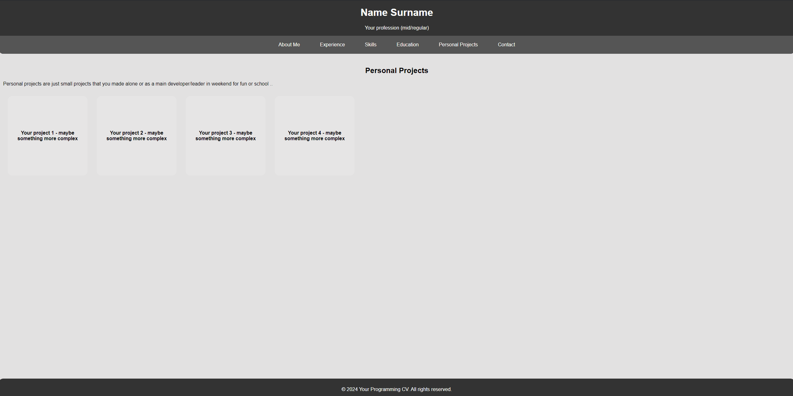
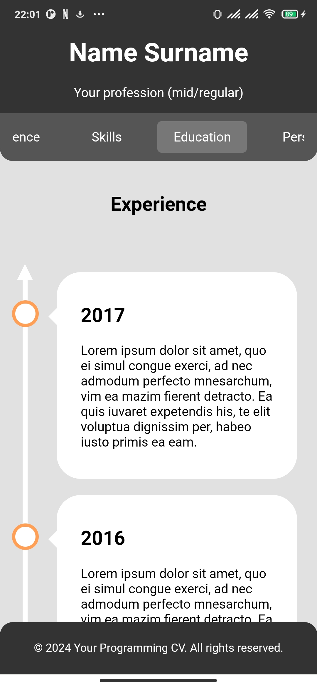
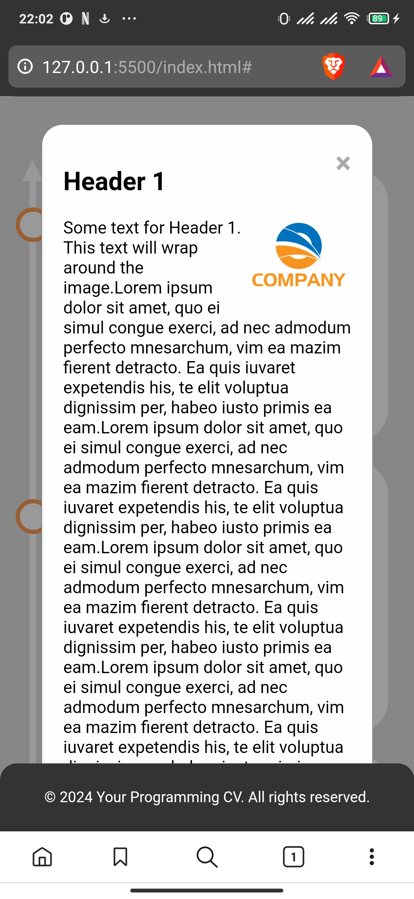
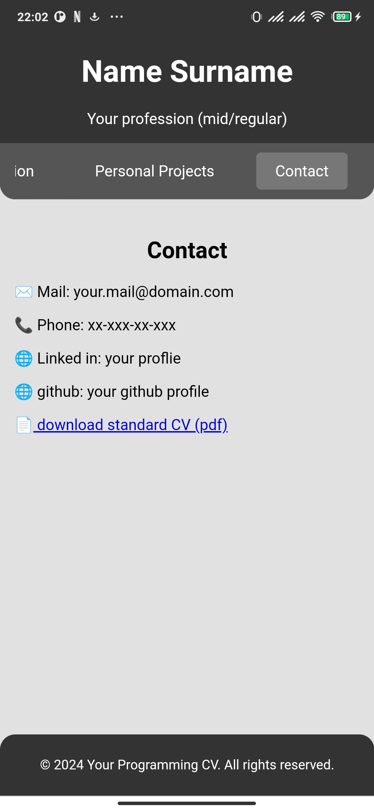

# Intearactive cv for devs in html

## About Project 
Initially created as the way to extend my cv one weekend. Later i thought maybe someone else could run into the same problem so i will leave it here just in case. Looks quite nice on pc and mobile. Easily adaptable and extremely lightweight.

## Showcase

### Animated timeline





### Pop-up window on timeline


### Contact with downloadable cv



## Debugging on phone 
I recomend using liveserver with plugged in phone.

You can easly forwar port using command.
```
adb reverse tcp:5500 tcp:5500
```

## Credits
Timeline inspiration - [W3schools](https://www.w3schools.com/howto/howto_css_timeline.asp)
